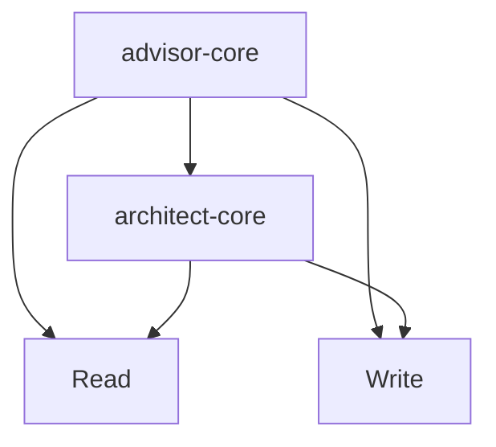

# Dependency Analyzer

## Purpose

Dependency Analyzer 是依赖关系分析组件，负责递归分析组件间的依赖关系，构建可视化的依赖图，并发现隐式调用和潜在循环依赖。本组件帮助理解系统架构的耦合度和依赖健康度。

## Workflow

### Step 1: 识别分析目标
**目标**: 确定依赖分析的入口点
**操作**:
1. 读取目标文件路径或目录
2. 识别组件类型 (Skill/SubAgent)
3. 确定分析深度 (direct/transitive/full)
**输出**: 分析目标元数据
**错误处理**: 目标不存在时返回错误

### Step 2: 显式依赖提取
**目标**: 提取文件中声明的显式依赖
**操作**:
1. 解析 YAML 头部的 allowed-tools
2. 提取 SubAgent 的 Task 调用目标
3. 识别文件引用 (@path 语法)
4. 解析 import/include 语句
**输出**: 显式依赖列表
**错误处理**: 解析失败时记录并继续

### Step 3: 隐式依赖发现
**目标**: 发现未声明的隐式调用关系
**操作**:
1. Grep 搜索组件名称引用
2. Grep 搜索文件路径引用
3. 分析数据流隐式依赖
4. 识别共享资源依赖
**输出**: 隐式依赖列表
**错误处理**: 搜索结果模糊时标注不确定性

### Step 4: 递归依赖分析
**目标**: 分析传递依赖 (间接依赖)
**操作**:
```
FUNCTION analyzeDependencies(target, visited):
  IF target IN visited THEN
    RETURN  # 避免循环
  END IF

  ADD target TO visited

  FOR each dependency OF target DO
    RECORD dependency
    RECURSIVE CALL analyzeDependencies(dependency, visited)
  END FOR
END FUNCTION
```
**输出**: 完整依赖树
**错误处理**: 递归深度超限时截断

### Step 5: 循环依赖检测
**目标**: 识别依赖图中的环路
**操作**:
1. 构建有向依赖图
2. 使用 DFS 检测环路
3. 记录所有发现的循环依赖
4. 标注关键循环
**输出**: 循环依赖列表
**错误处理**: 图构建失败时使用简化的检测

### Step 6: 生成依赖报告
**目标**: 输出依赖分析报告
**操作**:
1. 构建依赖可视化图 (Mermaid 格式)
2. 统计依赖指标
3. 识别高风险依赖
4. 生成改进建议
5. 写入报告文件
**输出**: 依赖分析报告
**错误处理**: 写入失败时重试

## Input Format

### 基本输入
```
<target-path> [--depth=direct|transitive|full]
```

### 输入示例
```
agents/advisor/advisor-core/SKILL.md
```

```
agents/ --depth=full
```

### 结构化输入 (可选)
```yaml
analysis:
  target: "agents/advisor/advisor-core/SKILL.md"
  options:
    depth: "transitive"  # direct|transitive|full
    includeImplicit: true
    detectCycles: true
  output:
    format: "mermaid"    # mermaid|dot|json
    maxDepth: 10         # 递归深度限制
```

## Output Format

### 标准输出结构
```json
{
  "target": "agents/advisor/advisor-core/SKILL.md",
  "analysisDate": "2024-03-01T10:30:00Z",
  "depth": "full",
  "dependencyGraph": {
    "nodes": [
      {"id": "advisor-core", "type": "subagent"},
      {"id": "architect-core", "type": "subagent"},
      {"id": "Read", "type": "tool"},
      {"id": "Write", "type": "tool"}
    ],
    "edges": [
      {"from": "advisor-core", "to": "architect-core", "type": "explicit"},
      {"from": "advisor-core", "to": "Read", "type": "tool"}
    ]
  },
  "statistics": {
    "directDependencies": 5,
    "transitiveDependencies": 12,
    "implicitDependencies": 3,
    "circularDependencies": 0
  },
  "circularDependencies": [],
  "implicitCalls": [
    {
      "caller": "review-aggregator",
      "callee": "review-core",
      "evidence": "Grep 匹配 Task 调用",
      "confidence": 0.85
    }
  ],
  "riskAssessment": {
    "highCoupling": [],
    "singlePointOfFailure": [],
    "deepDependencyChain": []
  },
  "visualization": "mermaid\ngraph TD\n  advisor-core --> architect-core\n  advisor-core --> Read"
}
```

### Markdown 输出示例
```markdown
# 依赖分析报告

## 分析目标
- **文件**: agents/advisor/advisor-core/SKILL.md
- **深度**: full
- **时间**: 2024-03-01 10:30

## 依赖统计
| 类型 | 数量 |
|------|------|
| 直接依赖 | 5 |
| 传递依赖 | 12 |
| 隐式依赖 | 3 |
| 循环依赖 | 0 |

## 依赖图


## 直接依赖
1. **architect-core** (SubAgent) - 显式
2. **Read** (Tool) - 显式
3. **Write** (Tool) - 显式

## 隐式调用
1. **review-aggregator → review-core**
   - 证据：Task 调用匹配
   - 置信度：85%

## 循环依赖
无循环依赖发现 ✅

## 风险评估

### 高风险
无

### 中风险
- advisor-core 依赖 5 个组件，耦合度中等

### 低风险
- 无深依赖链

## 建议
1. 考虑将隐式调用显式化，提高可维护性
```


## Error Handling

关键错误处理策略：

| 场景 | 处理 |
|------|------|
| 组件 SKILL.md 不存在 | 记录错误，继续其他 |
| 命令文件缺失 | 记录警告 |
| 工作流分析失败 | 使用 fallback 逻辑 |
| 循环依赖 | 检测并报告 |

> 详细错误处理：references/error-handling.txt（如果存在）

## Examples

| 场景 | 输出 |
|------|------|
| 单组件分析 | 依赖列表 |
| 批量分析 | 依赖图 |
| 循环检测 | 循环路径报告 |
| 缺失依赖 | 补全建议 |

> 详细示例：references/examples.txt（如果存在）

## Notes

### Best Practices

1. 扫描 commands/目录
2. 构建调用图
3. 验证连贯性
4. 检测循环依赖

### Integration

```
Review Core → Dependency Analyzer → 修复建议
```

### Files

- 输入：`agents/{component-path}/SKILL.md` + `commands/`
- 输出：`docs/analysis/{component-name}-dependencies.md`
