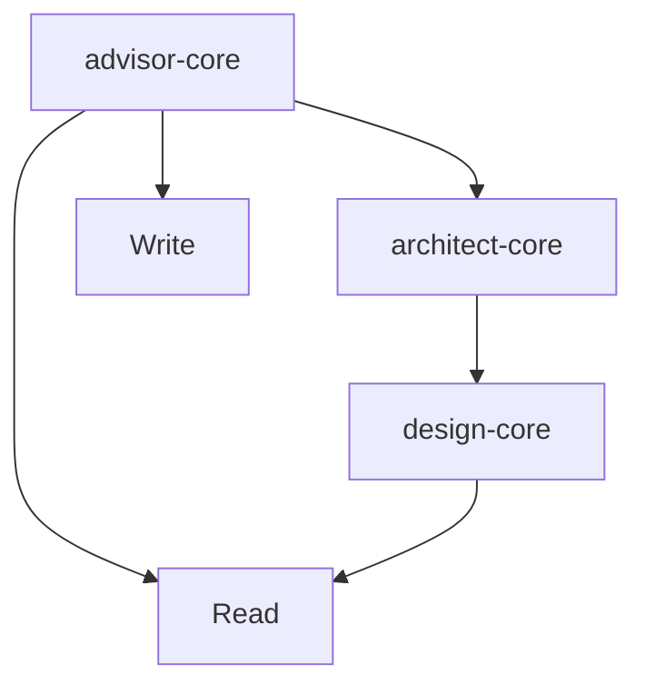

# Linkage Validator

## Purpose

Linkage Validator 是调用链路验证组件，负责解析组件间的调用关系，构建完整的调用图，并验证调用链路是否符合设计规则。本组件确保系统内所有调用都是连贯、可追溯、无循环的。

## Workflow

### Step 1: 解析入口点
**目标**: 确定调用链的起始点
**操作**:
1. 读取入口文件路径
2. 识别组件类型和接口
3. 提取初始调用声明
4. 验证入口点有效性
**输出**: 入口点元数据
**错误处理**: 入口点无效时提示修正

### Step 2: 提取直接调用
**目标**: 识别入口点的直接调用目标
**操作**:
1. 解析 YAML 头部的 allowed-tools
2. 提取 Task 调用目标
3. 识别文件引用和 import
4. 记录调用类型 (同步/异步)
**输出**: 直接调用列表
**错误处理**: 解析失败时标注不确定性

### Step 3: 递归构建调用图
**目标**: 递归追踪调用链构建完整图
**操作**:
```
FUNCTION buildCallGraph(target, visited, depth):
  IF target IN visited OR depth > maxDepth THEN
    RETURN
  END IF

  ADD target TO visited
  ADD target TO graph

  FOR each call OF target DO
    ADD edge (target → call)
    RECURSIVE CALL buildCallGraph(call, visited, depth+1)
  END FOR
END FUNCTION
```
**输出**: 完整调用图
**错误处理**: 深度超限时截断并标注

### Step 4: 验证链路规则
**目标**: 检查调用链路是否符合规则
**操作**:

| 规则 | 检查内容 | 违规处理 |
|------|----------|----------|
| 无循环 | 调用图无环路 | 高优先级告警 |
| 类型一致 | 调用双方类型匹配 | 中优先级告警 |
| 权限充分 | 调用方有足够权限 | 高优先级告警 |
| 参数匹配 | 参数类型数量匹配 | 中优先级告警 |
| 上下文兼容 | main/fork 上下文兼容 | 低优先级告警 |

**输出**: 规则验证结果
**错误处理**: 规则冲突时标注冲突点

### Step 5: 识别隐式调用
**目标**: 发现未在代码中显式声明的调用
**操作**:
1. Grep 搜索组件名称引用
2. 分析数据流隐式依赖
3. 识别事件驱动调用
4. 标注隐式调用置信度
**输出**: 隐式调用列表
**错误处理**: 置信度低时标注可能误报

### Step 6: 生成链路报告
**目标**: 输出调用链路验证报告
**操作**:
1. 汇总调用图统计信息
2. 列出所有规则违规
3. 生成修复建议
4. 写入报告文件
**输出**: 链路验证报告
**错误处理**: 写入失败时重试

## Input Format

### 基本输入
```
<entry-point-path> [--depth=full|shallow|deep]
```

### 输入示例
```
agents/advisor/advisor-core/SKILL.md
```

```
agents/reviewer/review-aggregator/SKILL.md --depth=deep
```

### 结构化输入 (可选)
```yaml
validation:
  entryPoint: "agents/advisor/advisor-core/SKILL.md"
  options:
    depth: "full"         # shallow|full|deep
    detectImplicit: true  # 检测隐式调用
    validateRules: true   # 验证规则
  rules:
    - noCircular
    - typeMatch
    - permissionCheck
```

## Output Format

### 标准输出结构
```json
{
  "entryPoint": "agents/advisor/advisor-core/SKILL.md",
  "depth": "full",
  "callGraph": {
    "nodes": [
      {"id": "advisor-core", "type": "subagent"},
      {"id": "architect-core", "type": "subagent"},
      {"id": "Read", "type": "tool"}
    ],
    "edges": [
      {"from": "advisor-core", "to": "architect-core", "type": "task"},
      {"from": "advisor-core", "to": "Read", "type": "tool"}
    ]
  },
  "statistics": {
    "totalNodes": 8,
    "totalEdges": 12,
    "maxDepth": 4,
    "implicitCalls": 2
  },
  "ruleViolations": [
    {
      "rule": "noCircular",
      "severity": "HIGH",
      "location": ["module-a", "module-b", "module-a"],
      "description": "检测到循环调用",
      "suggestion": "引入中间层打破循环"
    }
  ],
  "implicitCalls": [
    {
      "caller": "review-aggregator",
      "callee": "review-core",
      "evidence": "Task 调用匹配",
      "confidence": 0.85
    }
  ],
  "visualization": "mermaid\ngraph TD\n  advisor-core --> architect-core"
}
```

### Markdown 输出示例
```markdown
# 链路验证报告

## 基本信息
- **入口点**: advisor-core
- **深度**: full
- **时间**: 2024-03-01 10:30

## 调用图统计
| 指标 | 值 |
|------|-----|
| 节点数 | 8 |
| 边数 | 12 |
| 最大深度 | 4 |
| 隐式调用 | 2 |

## 调用图


## 规则验证

### ✅ 无循环规则
未发现循环调用

### ✅ 类型一致规则
所有调用类型匹配

### ⚠️ 权限检查规则
1 个问题：
- review-core 调用 Write 但缺少 fork 上下文标注

## 隐式调用
1. **review-aggregator → review-core**
   - 证据：Task 调用匹配
   - 置信度：85%
   - 建议：显式声明调用关系

## 修复建议

### HIGH 优先级
1. **标注 fork 上下文**: review-core 需要 fork context

### LOW 优先级
2. **显式化隐式调用**: 在文档中声明调用关系
```

## Error Handling

| 错误场景 | 处理策略 | 示例 |
|----------|----------|------|
| 入口点不存在 | 返回错误并提示检查路径 | "入口点不存在：xxx" |
| 递归深度超限 | 截断递归并标注 | "深度超过 10 层，已截断" |
| 调用图构建失败 | 使用简化的列表展示 | "图构建失败，使用列表展示" |
| 规则验证冲突 | 标注冲突点 | "规则 A 和规则 B 冲突" |
| 隐式调用误报 | 标注置信度 | "置信度 50%，可能误报" |
| 报告写入失败 | 重试并返回内存结果 | "写入失败，结果保存在内存中" |

## Examples

### Example 1: 简单链路验证

**输入**:
```
agents/advisor/advisor-core/SKILL.md
```

**输出**:
```json
{
  "entryPoint": "advisor-core",
  "statistics": {"totalNodes": 3, "totalEdges": 2},
  "ruleViolations": [],
  "status": "PASSED"
}
```

### Example 2: 深度调用分析

**输入**:
```
agents/reviewer/review-aggregator/SKILL.md --depth=deep
```

**输出**:
```json
{
  "entryPoint": "review-aggregator",
  "statistics": {"totalNodes": 12, "totalEdges": 18, "maxDepth": 5},
  "ruleViolations": [],
  "implicitCalls": 3
}
```

### Example 3: 循环依赖检测

**输入**:
```
agents/module-a/SKILL.md --depth=full
```

**输出**:
```json
{
  "ruleViolations": [
    {
      "rule": "noCircular",
      "severity": "HIGH",
      "cycle": ["module-a", "module-b", "module-c", "module-a"]
    }
  ]
}
```

### Example 4: 隐式调用发现

**输入**:
```
project-root/ --depth=deep
```

**输出**:
```json
{
  "implicitCalls": [
    {
      "caller": "coordinator",
      "callee": "worker-1",
      "confidence": 0.90
    }
  ]
}
```

### Example 5: 权限规则验证

**输入**:
```
agents/advisor/skill-with-write/SKILL.md
```

**输出**:
```json
{
  "ruleViolations": [
    {
      "rule": "permissionCheck",
      "severity": "HIGH",
      "description": "main context 包含 Write 工具"
    }
  ]
}
```

## Notes

### Best Practices

1. **深度限制**: 设置合理的递归深度避免无限追踪
2. **规则清晰**: 验证规则要明确可执行
3. **置信度标注**: 隐式调用标注置信度
4. **可视化**: 使用 Mermaid 等工具可视化
5. **增量验证**: 变更后只验证受影响链路

### Common Pitfalls

1. ❌ **无限递归**: 没有 visited 集合导致死循环
2. ❌ **规则模糊**: 规则不可执行无法验证
3. ❌ **过度告警**: 低置信度隐式调用高优先级告警
4. ❌ **缺少可视化**: 只输出 JSON 难以理解
5. ❌ **忽略上下文**: 不考虑 main/fork 上下文兼容性

### Validation Rules

| 规则 | 说明 | 违规示例 |
|------|------|----------|
| noCircular | 禁止循环调用 | A→B→C→A |
| typeMatch | 调用类型匹配 | Skill 调用 SubAgent |
| permissionCheck | 权限充分 | main context 用 Write |
| paramMatch | 参数匹配 | 参数数量类型不一致 |
| contextCompatible | 上下文兼容 | fork 调用 main 未清理 |

### Depth Modes

| 模式 | 说明 | 适用场景 |
|------|------|----------|
| shallow | 仅直接调用 | 快速检查 |
| full | 包含间接调用 | 完整验证 |
| deep | full + 隐式调用 | 深度审计 |

### Integration with CCC Workflow

```
Entry Point
    ↓
Linkage Validator (本组件) → 调用链分析
    ↓
Architecture Analyzer → 架构评估
    ↓
Report Renderer → 报告生成
```

### File References

- 输入：入口点文件路径
- 输出：`docs/linkage-analysis/{component-name}-linkage.md`
- 输出：`docs/linkage-analysis/{component-name}-linkage.json`
