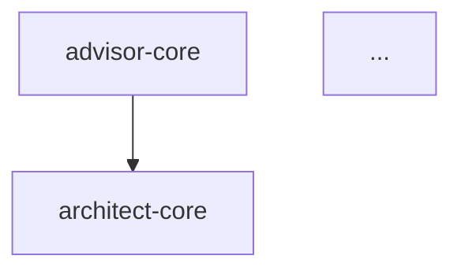

# Report Renderer

## Purpose

Report Renderer 是报告渲染组件，负责将结构化的 JSON 审查数据填充到预定义模板中，生成格式美观、内容完整的 Markdown 审阅报告。本组件遵循"模板驱动渲染"原则，确保报告格式一致、内容规范。

## Workflow

### Step 1: 加载 JSON 数据
**目标**: 读取结构化的审阅数据
**操作**:
1. 读取 JSON 数据文件路径
2. 验证文件存在性和可读性
3. 解析 JSON 内容
4. 验证数据结构完整性
**输出**: 审阅数据对象
**错误处理**: 数据格式错误时返回错误

### Step 2: 选择渲染模板
**目标**: 根据报告类型选择合适模板
**操作**:
```
CASE 数据类型 OF
  review-aggregated → 审阅聚合报告模板
  architecture-analysis → 架构分析报告模板
  dependency-analysis → 依赖分析报告模板
  migration-review → 改造方案审阅模板
  linkage-validation → 链路验证报告模板
  DEFAULT → 通用报告模板
END CASE
```
**输出**: 选定的模板
**错误处理**: 模板缺失时使用通用模板

### Step 3: 数据预处理
**目标**: 转换数据格式适配模板
**操作**:
1. 计算派生指标 (百分比、趋势)
2. 格式化时间戳和数字
3. 排序和过滤数据
4. 准备图表数据
**输出**: 模板就绪数据
**错误处理**: 预处理失败时使用原始数据

### Step 4: 模板填充
**目标**: 将数据填充到模板中
**操作**:
1. 解析模板占位符 ({{variable}} 语法)
2. 替换所有占位符为实际数据
3. 处理条件渲染 (if/else 逻辑)
4. 处理循环渲染 (for 循环列表)
**输出**: 渲染后的 Markdown 内容
**错误处理**: 占位符未匹配时保留原样并记录警告

### Step 5: 后处理优化
**目标**: 优化渲染后的内容
**操作**:
1. 清理多余空行
2. 修正 Markdown 格式
3. 添加目录 (如需要)
4. 检查链接有效性
**输出**: 优化后的 Markdown
**错误处理**: 优化失败时返回原始渲染结果

### Step 6: 写入报告文件
**目标**: 保存渲染后的报告
**操作**:
1. 确定输出文件路径
2. 创建输出目录 (如需要)
3. 写入 Markdown 文件
4. 验证写入成功
**输出**: 报告文件路径
**错误处理**: 写入失败时重试并报告

## Input Format

### 基本输入
```
<json-data-path>
```

### 输入示例
```
docs/reviews/aggregated-result.json
```

```
docs/architecture-review/analysis-result.json
```

### 结构化输入 (可选)
```yaml
render:
  dataPath: "docs/reviews/aggregated-result.json"
  options:
    template: "review-aggregated"  # 指定模板
    outputPath: "docs/reports/"    # 输出目录
    includeToc: true               # 包含目录
    format: "markdown"             # markdown|html
```

### JSON 数据结构示例
```json
{
  "reportType": "review-aggregated",
  "title": "审阅聚合报告",
  "date": "2024-03-01",
  "summary": {
    "totalFiles": 16,
    "overallScore": 82,
    "totalIssues": 45
  },
  "issuesBySeverity": {
    "ERROR": 2,
    "WARNING": 15,
    "INFO": 28
  },
  "components": [...],
  "recommendations": [...]
}
```

## Output Format

### 标准输出结构
```json
{
  "status": "COMPLETED",
  "inputPath": "docs/reviews/aggregated-result.json",
  "outputPath": "docs/reports/review-aggregated-2024-03-01.md",
  "template": "review-aggregated",
  "renderTime": "1.2s",
  "statistics": {
    "placeholdersReplaced": 45,
    "listsRendered": 8,
    "tablesRendered": 5,
    "chartsRendered": 3
  },
  "warnings": [
    {"type": "UNMATCHED_PLACEHOLDER", "placeholder": "{{missing}}"}
  ]
}
```

### Markdown 输出示例
```markdown
# 审阅聚合报告

**生成时间**: 2024-03-01 14:00
**报告类型**: 审阅聚合

## 执行摘要

| 指标 | 值 |
|------|-----|
| 审阅文件 | 16 |
| 综合分数 | 82/100 |
| 发现问题 | 45 |

## 问题分布

```
ERROR   ██ 2
WARNING ███████████████ 15
INFO    ████████████████████████████ 28
```

## 组件健康度

| 组件 | 分数 | 问题数 | 状态 |
|------|------|--------|------|
| design-core | 96 | 1 | ✅ |
| advisor-core | 92 | 2 | ✅ |

## 改进建议

1. **错误处理文档** - 5 个组件缺少错误处理说明
2. **示例补充** - 4 个组件缺少使用示例
```

## Error Handling

| 错误场景 | 处理策略 | 示例 |
|----------|----------|------|
| JSON 文件不存在 | 返回错误并提示检查路径 | "文件不存在：docs/reviews/xxx.json" |
| JSON 格式错误 | 返回解析错误详情 | "JSON 解析失败：第 25 行缺少逗号" |
| 模板缺失 | 使用通用模板继续 | "模板 review-aggregated 缺失，使用通用模板" |
| 占位符未匹配 | 保留原样并记录警告 | "{{missing}} 未找到数据" |
| 输出目录不存在 | 自动创建目录 | "创建目录 docs/reports/" |
| 文件写入失败 | 重试 1 次并报告 | "写入失败，重试中..." |

## Examples

### Example 1: 审阅聚合报告渲染

**输入**:
```
docs/reviews/aggregated-result.json
```

**输出**:
```json
{
  "status": "COMPLETED",
  "outputPath": "docs/reports/review-aggregated-2024-03-01.md",
  "template": "review-aggregated",
  "statistics": {
    "placeholdersReplaced": 45,
    "tablesRendered": 5
  }
}
```

### Example 2: 架构分析报告渲染

**输入**:
```
docs/architecture-review/analysis-result.json
```

**输出**:
```markdown
# 架构评估报告

## 综合评分
**85/100** - 良好

## 维度评分
工作流架构  88/100
组件设计    85/100
...
```

### Example 3: 依赖分析报告渲染

**输入**:
```
docs/dependency-analysis/deps-result.json
```

**输出**:
```markdown
# 依赖分析报告

## 依赖图

```

### Example 4: 自定义模板渲染

**输入**:
```
docs/reviews/custom.json --template=custom-template
```

**输出**:
```json
{
  "status": "COMPLETED",
  "template": "custom-template",
  "outputPath": "docs/reports/custom-report.md"
}
```

### Example 5: 批量渲染

**输入**:
```
docs/reviews/batch/*.json --output-dir=docs/reports/
```

**输出**:
```json
{
  "status": "COMPLETED",
  "filesRendered": 5,
  "outputFiles": [
    "docs/reports/report-1.md",
    "docs/reports/report-2.md"
  ]
}
```

## Notes

### Best Practices

1. **模板分离**: 不同报告类型使用不同模板
   **为什么**: 每种报告类型有独特的结构和内容需求，分离模板确保针对性渲染
   **风险**: 高 - 模板耦合会导致渲染逻辑复杂难以维护

2. **占位符规范**: 使用 {{variable}} 统一语法
   **为什么**: 统一语法确保模板解析一致性，降低解析错误
   **风险**: 中 - 语法不统一会导致占位符匹配失败

3. **条件渲染**: 支持 if/else 逻辑处理可选内容
   **为什么**: 可选数据（如警告、建议）在缺失时不应显示空章节
   **风险**: 中 - 缺少条件渲染会产生空内容章节影响可读性

4. **循环渲染**: 支持 for 循环渲染列表表格
   **为什么**: 列表和表格数据通常是数组，循环渲染确保完整展示
   **风险**: 中 - 循环错误会导致数据截断或重复

5. **格式校验**: 渲染后验证 Markdown 格式正确
   **为什么**: 确保生成的报告可被 Markdown 渲染器正确解析
   **风险**: 高 - 格式错误会导致报告无法阅读

6. **可折叠设计**: 长报告使用 HTML details/summary 实现可折叠
   **为什么**: 长报告包含大量细节，可折叠设计支持渐进式阅读，降低认知负荷
   **风险**: 中 - 缺少可折叠会导致报告冗长难以导航

7. **视觉引导**: 使用符号、进度条、表格增强视觉引导
   **为什么**: 视觉元素帮助快速定位关键信息，提高报告可读性
   **风险**: 中 - 缺少视觉引导会降低信息获取效率

8. **关键信息高亮**: 质量分数、问题分级使用醒目格式
   **为什么**: 关键信息需要第一时间吸引注意力，支持快速决策
   **风险**: 高 - 关键信息不突出会导致重要问题被忽略

### Common Pitfalls

1. ❌ **硬编码内容**: 报告内容应该来自数据而非硬编码
2. ❌ **模板耦合**: 模板不应该包含业务逻辑
3. ❌ **格式混乱**: 渲染后不验证 Markdown 格式
4. ❌ **链接失效**: 内部链接不验证有效性
5. ❌ **缺少目录**: 长报告没有目录导航
6. ❌ **不可折叠**: 长报告所有内容展开，难以导航
7. ❌ **视觉单一**: 缺少符号、进度条等视觉引导元素
8. ❌ **重点不突出**: 关键信息（分数、问题）没有高亮显示

### Template Syntax

**可折叠设计**:

```html
<details>
  <summary>📊 问题详情（点击展开）</summary>
  详细内容...
</details>
```

**视觉引导元素**:

| 元素 | 用途 | 示例 |
|------|------|------|
| 状态符号 | 快速识别状态 | ✅ 通过 ⚠️ 警告 ❌ 错误 |
| 进度条 | 可视化完成度 | `[████████░░] 80%` |
| 严重性标记 | 区分问题级别 | 🔴 ERROR | 🟡 WARNING | 🟢 INFO |
| 质量分数 | 大标题高亮 | `**85/100**` |

**关键信息高亮**:

```markdown
## 综合评分

# 🔴 45/100 (需改进)  # 使用大标题和颜色

## 问题摘要

| 严重性 | 数量 |
|--------|------|
| 🔴 ERROR | 2 |  # 使用 emoji 高亮
| 🟡 WARNING | 15 |
| 🟢 INFO | 28 |
```

---

### Template Syntax

```
变量替换：{{variable}}
条件渲染：{{#if condition}}...{{/if}}
循环渲染：{{#each list}}...{{/each}}
格式函数：{{formatDate date}}, {{formatNumber num}}
```

### Built-in Templates

| 模板名称 | 用途 | 数据结构 |
|----------|------|----------|
| review-aggregated | 审阅聚合报告 | AggregatedReview |
| architecture-analysis | 架构分析报告 | ArchitectureAnalysis |
| dependency-analysis | 依赖分析报告 | DependencyAnalysis |
| migration-review | 改造方案审阅 | MigrationReview |
| linkage-validation | 链路验证报告 | LinkageValidation |
| generic | 通用报告 | Any |

### Integration with CCC Workflow

```
JSON Data (from any analyzer)
    ↓
Report Renderer (本组件) → 模板填充
    ↓
Markdown Report
```

### File References

- 输入：JSON 数据文件路径
- 模板目录：`docs/templates/`
- 输出：`docs/reports/{report-type}-{date}.md`
