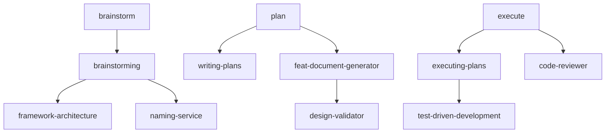

# Workflow Discoverer

## Purpose

Workflow Discoverer 是工作流自动发现组件，负责：
1. **自动扫描** commands/目录识别所有入口命令
2. **递归追踪**从命令到 Skills/SubAgents 的调用链
3. **构建完整**的工作流调用图（Call Graph）
4. **验证连贯性**检测断点、隐式调用、循环依赖
5. **生成报告**包含可视化工作流图和问题清单

本组件解决 Review 功能无法主动识别目标插件整体工作流的问题。

## Workflow

### Step 1: 扫描入口命令
**目标**: 识别所有工作流入口点
**操作**:
```
1. Glob 扫描 commands/ 目录获取所有 .md 文件
2. 解析每个命令文件的 YAML 头部
3. 提取 name、description、argument-hint
4. 识别触发场景（从 description 和正文）
5. 标注入口类型：
   - Entry: 用户直接调用的命令
   - Internal: 仅内部调用的命令
```
**输出**: 入口命令清单
**错误处理**: 无法解析的文件记录警告继续

### Step 2: 追踪调用链
**目标**: 从每个入口递归追踪调用关系
**操作**:
```
FUNCTION traceCalls(file, visited, depth):
  IF file IN visited OR depth > maxDepth THEN
    RETURN
  END IF

  ADD file TO visited

  // 提取显式调用
  calls = extractTaskCalls(file)      // Task 调用
  calls += extractSkillReferences(file) // Skill 引用
  calls += extractFileReferences(file)  // @path 引用

  FOR each call IN calls DO
    ADD edge (file → call)
    RECURSIVE CALL traceCalls(call, visited, depth+1)
  END FOR
END FUNCTION
```
**输出**: 调用链集合
**错误处理**: 深度超限截断并标注

### Step 3: 发现隐式调用
**目标**: 识别未在代码中显式声明的调用
**操作**:
1. Grep 搜索组件名称引用
2. 分析数据流隐式依赖（文件输入输出）
3. 识别事件驱动调用（hooks）
4. 标注隐式调用置信度
**输出**: 隐式调用列表
**错误处理**: 置信度低时标注可能误报

### Step 4: 验证工作流连贯性
**目标**: 检测工作流断点和一致性问题
**操作**:

| 检查项 | 方法 | 违规处理 |
|--------|------|----------|
| 断点检测 | 调用链中断 | 高优先级告警 |
| 循环依赖 | DFS 检测环路 | 高优先级告警 |
| 参数匹配 | 验证输入输出兼容 | 中优先级告警 |
| 上下文兼容 | main/fork 检查 | 低优先级告警 |
| 状态流转 | Phase 转移验证 | 中优先级告警 |

**输出**: 连贯性验证报告
**错误处理**: 规则冲突时标注冲突点

### Step 5: 比对官方最佳实践
**目标**: 基于 Anthropic skill-creator 规范验证工作流
**操作**:
1. 加载官方 skill-creator 规范作为参考
2. 检查工作流是否符合 Progressive Disclosure
3. 验证是否有 eval/测试机制
4. 检查是否有迭代循环支持
5. 比对调用深度是否合理（官方建议<5 层）

**输出**: 最佳实践符合度报告
**错误处理**: 规范加载失败时使用默认规则

### Step 6: 生成工作流报告
**目标**: 输出完整工作流分析报告
**操作**:
1. 构建 Mermaid 可视化图
2. 统计工作流指标（节点数、深度、分支）
3. 列出所有发现的问题
4. 生成修复建议
5. 写入报告文件

**输出**: 工作流分析报告（Markdown + JSON + Mermaid）
**错误处理**: 写入失败时重试

## Input Format

### 基本输入
```
<project-path> [--depth=shallow|full|deep] [--output=json|markdown|mermaid]
```

### 输入示例
```
/Users/xqh/project --depth=full
```

```
/Users/xqh/project --output=mermaid
```

### 参数说明

| 参数 | 默认值 | 说明 |
|------|--------|------|
| `--depth` | full | 分析深度：shallow(仅命令)、full(包含 Skills)、deep(包含隐式调用) |
| `--output` | markdown | 输出格式：json、markdown、mermaid |

### 结构化输入 (可选)
```yaml
discovery:
  projectPath: "/Users/xqh/project"
  options:
    depth: "full"
    output: "markdown"
    includeImplicit: true
    validateAgainstOfficial: true
  filters:
    commands: ["commands/*.md"]
    exclude: ["tests/**"]
```

## Output Format

### 标准输出结构
```json
{
  "projectPath": "/Users/xqh/project",
  "analysisDate": "2026-03-05T10:30:00Z",
  "entryPoints": [
    {
      "command": "brainstorm",
      "file": "commands/brainstorm.md",
      "triggers": ["brainstorming", "design", "architecture"],
      "calls": ["brainstorming (Skill)"]
    },
    {
      "command": "plan",
      "file": "commands/plan.md",
      "triggers": ["plan", "design"],
      "calls": ["writing-plans (Skill)", "feat-document-generator (SubAgent)"]
    }
  ],
  "callGraph": {
    "nodes": [
      {"id": "brainstorm", "type": "command"},
      {"id": "brainstorming", "type": "skill"},
      {"id": "framework-architecture", "type": "skill"}
    ],
    "edges": [
      {"from": "brainstorm", "to": "brainstorming", "type": "explicit"},
      {"from": "brainstorming", "to": "framework-architecture", "type": "explicit"}
    ]
  },
  "statistics": {
    "totalCommands": 19,
    "totalSkills": 68,
    "totalSubAgents": 4,
    "maxDepth": 5,
    "implicitCalls": 3,
    "circularDependencies": 0
  },
  "workflowIssues": [
    {
      "id": "WF-001",
      "severity": "HIGH",
      "type": "broken_chain",
      "location": ["plan", "feat-document-generator"],
      "description": "计划阶段到执行阶段的调用链缺少明确声明",
      "suggestion": "在 plan.md 中显式声明 execute 命令的调用"
    }
  ],
  "officialCompliance": {
    "progressiveDisclosure": true,
    "hasEvalMechanism": false,
    "hasIterationSupport": true,
    "callDepthAcceptable": true,
    "score": 85
  },
  "visualization": "mermaid\ngraph TD\n  brainstorm --> brainstorming\n  brainstorming --> framework-architecture"
}
```

### Markdown 输出示例
```markdown
# 工作流分析报告

## 项目信息
- **路径**: /Users/xqh/project
- **分析时间**: 2026-03-05 10:30
- **深度**: full

## 入口命令 (19 个)

| 命令 | 文件 | 触发场景 | 调用目标 |
|------|------|----------|----------|
| brainstorm | commands/brainstorm.md | brainstorming, design | brainstorming (Skill) |
| plan | commands/plan.md | plan, design | writing-plans, feat-document-generator |
| execute | commands/execute.md | execute, implement | executing-plans, code-reviewer |

## 工作流调用图



## 工作流完整性验证

### 断点检测
✅ 未发现断点 - 所有调用链完整

### 循环依赖
✅ 未发现循环依赖

### 参数匹配
⚠️ 1 个问题:
- plan → feat-document-generator: 输出格式未明确声明

## 官方最佳实践符合度

| 检查项 | 状态 | 说明 |
|--------|------|------|
| Progressive Disclosure | ✅ | 使用 references/目录 |
| Eval 机制 | ❌ | 缺少测试用例定义 |
| 迭代支持 | ✅ | 有 ccc:iterate 命令 |
| 调用深度 | ✅ | 最大深度 4 层 (<5 层) |
| **综合评分** | **85/100** | |

## 修复建议

### HIGH 优先级
1. **明确声明 execute 调用** - 在 design.md 中添加执行阶段的调用说明

### MEDIUM 优先级
2. **添加 Eval 机制** - 为关键技能创建测试用例
```

## Error Handling

详细错误处理策略和场景说明，参见 [references/error-handling.md](references/error-handling.txt)。

核心策略表：

| 错误场景 | 处理策略 |
|----------|----------|
| 项目路径不存在 | 返回错误并提示检查路径 |
| commands/目录缺失 | 使用启发式扫描 Skills |
| 递归深度超限 | 截断递归并标注 |
| 调用图构建失败 | 使用简化的列表展示 |
| 循环检测超时 | 停止检测并报告部分结果 |
| 隐式调用误报 | 标注置信度 |
| 报告写入失败 | 重试并返回内存结果 |

---

## Examples

更多使用示例，参见 [references/examples.md](references/examples.txt)。

### 快速示例

```bash
# 标准工作流分析
workflow-discoverer /Users/xqh/project --depth=full

# 浅层分析（仅命令）
workflow-discoverer /Users/xqh/project --depth=shallow

# 深度分析（包含隐式调用）
workflow-discoverer /Users/xqh/project --depth=deep

# Mermaid 输出
workflow-discoverer /Users/xqh/project --output=mermaid
```

---

## Notes

详细最佳实践和集成说明，参见 [references/notes.md](references/notes.txt)。

### 核心原则

1. **入口识别**: 优先扫描 commands/目录
2. **深度限制**: 设置合理的递归深度（默认 10 层）
3. **可视化优先**: 使用 Mermaid 等工具可视化工作流

### 文件引用

- 输入：项目根目录
- 输出：`docs/workflow-analysis/{project-name}-workflow.md`
- 输出：`docs/workflow-analysis/{project-name}-workflow.json`
