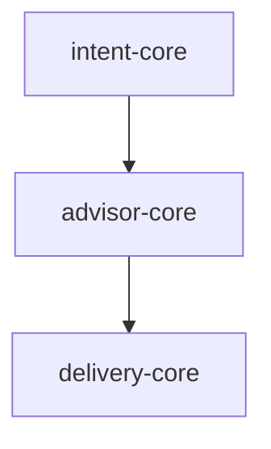

# Workflow Identifier

## Purpose

Workflow Identifier 是蓝图解析组件，负责从蓝图 YAML 文件中提取工作流阶段定义，识别组件依赖，并生成结构化工作流 JSON 供下游审查和执行使用。本组件遵循"解析一次，到处使用"原则，确保 CCC 系统中工作流的一致性。

## Workflow

### Step 1: 读取蓝图文件
**目标**: 加载并验证蓝图 YAML 文件
**操作**:
1. 读取蓝图文件内容
2. 解析 YAML frontmatter
3. 定位工作流章节
4. 验证蓝图结构
**输出**: 解析后的蓝图对象
**错误处理**: 如果文件不存在，返回带路径建议的错误

### Step 2: 解析阶段定义
**目标**: 从工作流章节提取阶段定义
**操作**:
1. 识别阶段名称和顺序
2. 提取阶段描述
3. 解析每个阶段的输入/输出规范
4. 映射阶段到组件的关系
**输出**: 带元数据的阶段列表
**错误处理**: 如果工作流章节缺失，返回空阶段列表并警告

### Step 3: 提取组件
**目标**: 识别每个阶段中引用的所有组件
**操作**:
1. 扫描 SubAgent 引用 (subagent_type 字段)
2. 扫描 Skill 引用 (skill="..." 语法)
3. 扫描 Command 引用 (/command-name 语法)
4. 记录组件类型并解析文件路径
**输出**: 带类型和路径的组件列表
**错误处理**: 如果路径不存在，标记为"缺失"并继续解析

### Step 4: 构建依赖图
**目标**: 构建组件依赖关系图
**操作**:
1. 为每个组件创建节点 (id, type, phase, path)
2. 为顺序依赖创建边 (phase[i] → phase[i+1])
3. 从工作流描述中提取调用依赖
4. 从 I/O 规范推断数据流依赖
**输出**: 带节点和边的依赖图
**错误处理**: 如果图构建失败，使用简化的列表格式

### Step 5: 生成工作流 JSON
**目标**: 输出结构化工作流定义
**操作**:
1. 组装阶段、组件和依赖图
2. 计算统计信息 (总阶段数、组件数、边数)
3. 识别并行化机会
4. 写入 JSON 输出
**输出**: 结构化工作流 JSON 对象
**错误处理**: 如果文件写入失败，返回内存中的结果

## Input Format

### Basic Input
```
<blueprint-path>
```

### Input Examples
```
docs/ccc/blueprint/2026-03-03-BLP-001.yaml
```

```
docs/designs/my-project/stage-3-detailed-design.yaml
```

### Structured Input (Optional)
```yaml
task: identify-workflow
blueprint_path: docs/ccc/blueprint/2026-03-03-BLP-001.yaml
options:
  detect_parallel: true
  validate_paths: true
```

## Output Format

### Standard Output Structure
```json
{
  "status": "completed",
  "workflow": {
    "name": "CCC Review Workflow",
    "total_phases": 3,
    "total_components": 5,
    "phases": [
      {
        "name": "intent",
        "order": 1,
        "description": "Intent 创建阶段",
        "components": [
          {"id": "ccc:intent-core", "type": "subagent", "path": "agents/intent-core/SKILL.md"}
        ]
      },
      {
        "name": "design",
        "order": 2,
        "description": "设计阶段",
        "components": [
          {"id": "ccc:advisor-core", "type": "subagent", "path": "agents/advisor/advisor-core/SKILL.md"},
          {"id": "ccc:architect-core", "type": "subagent", "path": "agents/advisor/architect-core/SKILL.md"}
        ],
        "parallel_opportunities": ["ccc:advisor-core", "ccc:architect-core"]
      }
    ],
    "dependency_graph": {
      "nodes": [{"id": "ccc:intent-core", "type": "subagent", "phase": "intent"}],
      "edges": [{"from": "ccc:intent-core", "to": "ccc:advisor-core", "type": "sequential"}]
    }
  }
}
```

### Markdown Output Example
```markdown
# 工作流定义

## 摘要
- **总阶段数**: 3
- **总组件数**: 5
- **并行机会**: 2

## 阶段

### 阶段 1: Intent
- 组件：ccc:intent-core

### 阶段 2: Design
- 组件：ccc:advisor-core, architect-core, design-core
- 并行：advisor-core || architect-core

### 阶段 3: Build
- 组件：ccc:delivery-core

## 依赖图

```

## Error Handling

| 错误场景 | 处理策略 | 示例 |
|----------|----------|------|
| 蓝图文件不存在 | 返回带路径建议的错误 | "文件不存在：docs/xxx/blueprint.yaml" |
| YAML 解析失败 | 返回详细错误 | "YAML 解析失败：第 25 行缺少冒号" |
| 工作流章节缺失 | 返回空工作流并警告 | "工作流章节未找到，返回空" |
| 组件路径不存在 | 标记为缺失，继续解析 | "组件路径缺失：agents/xxx/SKILL.md" |
| 检测到循环依赖 | 警告并打破循环 | "检测到循环依赖：A→B→A" |

## Examples

### Example 1: 基本工作流识别

**Input**:
```
docs/ccc/blueprint/2026-03-03-BLP-001.yaml
```

**Output**:
```json
{
  "status": "completed",
  "workflow": {
    "name": "CCC Review Workflow",
    "total_phases": 3,
    "total_components": 5,
    "phases": [
      {"name": "intent", "order": 1, "components": [{"id": "ccc:intent-core", "type": "subagent"}]},
      {"name": "design", "order": 2, "components": [{"id": "ccc:advisor-core", "type": "subagent"}]},
      {"name": "build", "order": 3, "components": [{"id": "ccc:delivery-core", "type": "subagent"}]}
    ]
  }
}
```

### Example 2: 带并行机会的工作流

**Input**:
```
docs/ccc/blueprint/2026-03-03-BLP-002.yaml
```

**Output**:
```json
{
  "status": "completed",
  "workflow": {
    "total_phases": 2,
    "phases": [
      {
        "name": "review",
        "parallel_opportunities": ["ccc:review-core", "ccc:architecture-analyzer"]
      }
    ]
  }
}
```

### Example 3: 缺失组件处理

**Input**:
```
docs/ccc/blueprint/2026-03-03-BLP-003.yaml
```

**Output**:
```json
{
  "status": "completed",
  "warnings": [
    {"type": "MISSING_COMPONENT", "component": "legacy-agent", "path": "agents/legacy/SKILL.md"}
  ],
  "workflow": {...}
}
```

### Example 4: 空工作流章节

**Input**:
```
docs/ccc/blueprint/2026-03-03-BLP-004.yaml
```

**Output**:
```json
{
  "status": "completed",
  "warnings": [{"type": "EMPTY_WORKFLOW", "message": "未定义阶段"}],
  "workflow": {"phases": [], "dependency_graph": {"nodes": [], "edges": []}}
}
```

### Example 5: 复杂依赖图

**Input**:
```
docs/ccc/blueprint/2026-03-03-BLP-005.yaml
```

**Output**:
```json
{
  "status": "completed",
  "workflow": {
    "dependency_graph": {
      "nodes": [
        {"id": "ccc:intent-core", "type": "subagent", "phase": "intent"},
        {"id": "ccc:advisor-core", "type": "subagent", "phase": "design"},
        {"id": "ccc:delivery-core", "type": "subagent", "phase": "build"}
      ],
      "edges": [
        {"from": "ccc:intent-core", "to": "ccc:advisor-core", "type": "sequential"},
        {"from": "ccc:advisor-core", "to": "ccc:delivery-core", "type": "sequential"}
      ]
    }
  }
}
```

## Notes

### Best Practices

1. **早期验证**: 深度解析前检查蓝图结构
2. **标记缺失**: 不要在缺失组件时失败，标记并继续
3. **跟踪并行**: 识别并行化机会以优化
4. **优雅降级**: 错误时返回部分结果

### Common Pitfalls

1. ❌ **首个错误就失败**: 应该继续解析并收集所有问题
2. ❌ **忽略缺失路径**: 应该标记并警告缺失组件
3. ❌ **硬编码路径**: 应该相对于蓝图位置解析路径
4. ❌ **跳过验证**: 解析前应该验证蓝图结构

### Integration with CCC Workflow

```
蓝图文件
    ↓
Workflow Identifier (本组件) → 工作流 JSON
    ↓
审查工作流命令 → 健康报告
```

### File References

- 输入：蓝图文件路径
- 输出：`docs/workflows/{blueprint-name}-workflow.json`
