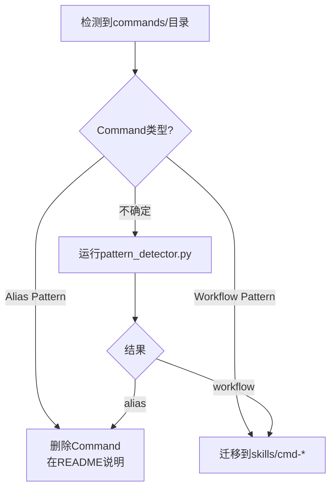

# Command到Skill迁移指南

**版本**: v3.1.1
**日期**: 2026-03-13
**状态**: Official

---

## 背景

官方Claude Code在最近版本中废弃了Command概念，将其完全合并到Skill。这意味着：

- ❌ `commands/` 目录将不再被加载
- ❌ Command相关的配置和API已移除
- ✅ 所有功能通过Skill实现
- ✅ 简化插件结构，统一组件类型

**影响范围**: 所有包含`commands/`目录的Claude Code插件

---

## 快速决策



---

## 模式分类

### Alias Pattern（快捷方式）

**特征**:
- 文件小于100行
- 只引用单个Skill
- 无复杂逻辑
- Description简短
- 无条件分支

**示例**:
```yaml
---
# commands/brainstorm.md
name: brainstorm
description: Brainstorming的快捷命令
---
调用brainstorming Skill。
```

**迁移方案**: 删除Command，在README.md中说明

### Workflow Pattern（工作流）

**特征**:
- 包含编号步骤
- 有条件分支
- 调用多个SubAgent
- 详细的工作流说明
- 文件大于200行

**示例**:
```yaml
---
# commands/code-review.md
name: code-review
description: 完整的代码审查工作流
tools: [Task, Read, Write]
---

## 工作流程
1. 扫描代码库
2. 调用review-core执行检测
3. 调用architecture-analyzer分析架构
4. 生成审查报告
```

**迁移方案**: 迁移到`skills/cmd-code-review/`

---

## 迁移步骤

### 方案A: Alias Pattern迁移

#### 步骤1: 确认模式
```bash
# 使用pattern_detector检测
python agents/reviewer/review-core/detectors/pattern_detector.py commands/your-command.md
```

如果结果为`ALIAS`，继续以下步骤。

#### 步骤2: 删除Command
```bash
rm commands/your-command.md
```

#### 步骤3: 更新README.md
在README.md的"可用命令"或"快捷命令"章节添加：

```markdown
## 可用命令 (Available Commands)

- `/your-command` - `target-skill`的快捷命令
  - 等同于直接调用`target-skill`
```

#### 步骤4: 验证
- 确保用户知道如何使用目标Skill
- 更新CHANGELOG.md

---

### 方案B: Workflow Pattern迁移

#### 步骤1: 确认模式
```bash
# 使用pattern_detector检测
python agents/reviewer/review-core/detectors/pattern_detector.py commands/your-command.md
```

如果结果为`WORKFLOW`，继续以下步骤。

#### 步骤2: 创建Skill目录
```bash
mkdir -p skills/cmd-your-command
```

#### 步骤3: 迁移COMMAND.md到SKILL.md
```bash
cp commands/your-command.md skills/cmd-your-command/SKILL.md
```

#### 步骤4: 更新frontmatter
编辑`skills/cmd-your-command/SKILL.md`，修改frontmatter：

```yaml
---
# 旧格式 (Command)
name: your-command
description: 原有描述
argument-hint: "<args>"
---

# 新格式 (Skill)
---
name: cmd-your-command  # ⚠️ 添加cmd-前缀
description: 原有描述  # 保持不变
argument-hint: "<args>"  # 保持不变
tools: [...]  # 保持不变
context: none  # 或根据需要调整
---
```

**关键变更**:
- `name`: 添加`cmd-`前缀（推荐但非强制）
- `context`: 明确声明（Command默认为none）
- 其他字段保持不变

#### 步骤5: 更新内容引用
使用全局替换（可选）：
```bash
# 将"Command"替换为"Skill"
sed -i 's/Command/Skill/g' skills/cmd-your-command/SKILL.md
```

**注意**: 保持原有工作流逻辑不变（"平迁"原则）

#### 步骤6: 迁移相关文件
```bash
# 迁移测试文件（如有）
if [ -d "commands/your-command/evals" ]; then
  cp -r commands/your-command/evals skills/cmd-your-command/
fi

# 迁移配置文件（如有）
if [ -d "commands/your-command/config" ]; then
  cp -r commands/your-command/config skills/cmd-your-command/
fi
```

#### 步骤7: 验证迁移结果
```bash
# 测试Skill是否正常工作
# 确认参数传递正确
# 验证输出格式一致
```

#### 步骤8: 删除原Command
```bash
# 确认一切正常后删除
rm -rf commands/your-command.md
```

#### 步骤9: 更新文档
- 更新README.md：说明从Command迁移到Skill
- 更新CHANGELOG.md：记录迁移
- 更新使用示例

---

## 自动化工具

### 使用migration_analyzer生成报告

```bash
# 分析整个插件的迁移状态
python agents/reviewer/review-core/detectors/migration_analyzer.py . zh

# 输出中文报告
# 包含：
#   - 所有Command列表
#   - 模式分类（Alias/Workflow）
#   - 迁移状态（completed/pending/partial）
#   - 详细迁移步骤
#   - 优先级建议
```

### 批量迁移脚本

创建`migrate-commands.sh`：

```bash
#!/bin/bash
# 批量迁移Workflow Pattern Commands

for cmd_file in commands/*.md; do
  # 提取Command名称
  cmd_name=$(basename "$cmd_file" .md)

  # 检测模式
  pattern=$(python agents/reviewer/review-core/detectors/pattern_detector.py "$cmd_file" | grep "Pattern:" | awk '{print $2}')

  if [ "$pattern" = "WORKFLOW" ]; then
    echo "Migrating $cmd_name (Workflow)..."

    # 创建目录
    mkdir -p "skills/cmd-$cmd_name"

    # 迁移文件
    cp "$cmd_file" "skills/cmd-$cmd_name/SKILL.md"

    # TODO: 手动更新frontmatter
    echo "  ⚠️ Please manually update frontmatter in skills/cmd-$cmd_name/SKILL.md"

    # 迁移测试（如有）
    if [ -d "commands/$cmd_name/evals" ]; then
      cp -r "commands/$cmd_name/evals" "skills/cmd-$cmd_name/"
      echo "  ✅ Migrated evals/"
    fi
  fi
done

echo "Migration setup complete. Review and test before deleting original Commands."
```

---

## 混合场景处理

### 场景1: Command包含多个Skill调用

**问题**: 一个Command依次调用3个Skill

**选项A（推荐）**: 平迁为单个Skill
```yaml
---
name: cmd-deploy
description: 部署工作流（内部路由到不同环境）
---
根据参数选择：
- production → 调用deploy-production
- staging → 调用deploy-staging
- test → 调用deploy-test
```

**选项B**: 拆分为多个Skill
- `cmd-deploy-production`
- `cmd-deploy-staging`
- `cmd-deploy-test`

**选择原则**: 优先选项A（保持用户体验），除非有明确的设计原因需要拆分。

### 场景2: 部分Command已迁移

使用`migration_analyzer`查看进度：

```bash
python agents/reviewer/review-core/detectors/migration_analyzer.py .
```

输出示例：
```
迁移进度: 2/5 migrated (40%)

已迁移:
- brainstorm (Alias) ✅
- code-review (Workflow) ✅

待迁移:
- deploy (Workflow) ⏳
- test (Alias) ⏳
- build (Workflow) ⏳
```

**建议**: 逐个迁移，测试通过后再继续下一个。

---

## 常见问题

### Q1: 必须添加`cmd-`前缀吗？

**A**: 不是强制的，但强烈推荐。`cmd-`前缀有以下好处：
- 明确标识为命令式Skill（用户入口）
- 避免与现有Skill命名冲突
- 符合CCC最佳实践（参考CCC自身的cmd-* Skills）

### Q2: context字段如何设置？

**A**:
- 原Command默认为`context: none`
- 迁移后保持`context: none`（除非有特殊需求）
- 如果Skill需要访问历史对话，可改为`context: full`或`context: recent`

### Q3: 如何处理argument-hint？

**A**:
- 完全保留原有的`argument-hint`
- 如果原Command有参数验证逻辑，建议添加参数验证文档（避免触发SKILL-025警告）

### Q4: 迁移后斜杠命令还能用吗？

**A**:
- ✅ **Workflow Pattern**: 可以，`/cmd-your-command`会调用`skills/cmd-your-command/`
- ❌ **Alias Pattern**: 不可以，因为Command已删除，用户需要直接调用目标Skill

### Q5: 如何确保向后兼容？

**A**:
- **Alias Pattern**: 在README中明确说明迁移，提供目标Skill名称
- **Workflow Pattern**: 保持相同的参数格式和输出格式
- 在CHANGELOG中记录破坏性变更（如有）

### Q6: 迁移过程中可以同时保留Command和Skill吗？

**A**:
- 技术上可以（渐进迁移期间）
- 但不推荐长期保留，因为Command会在未来版本中完全失效
- 建议尽快完成迁移

---

## 验证清单

迁移完成后，使用以下清单验证：

### Workflow Pattern迁移验证

- [ ] `skills/cmd-{name}/SKILL.md`存在
- [ ] frontmatter中`name`字段正确
- [ ] frontmatter中`context`字段已明确声明
- [ ] 原有`argument-hint`已保留
- [ ] 原有`tools`列表已保留
- [ ] 工作流逻辑保持不变
- [ ] 测试文件已迁移（如有）
- [ ] 功能测试通过
- [ ] 原Command已删除
- [ ] README已更新
- [ ] CHANGELOG已更新

### Alias Pattern迁移验证

- [ ] 原Command已删除
- [ ] README中添加了快捷命令说明
- [ ] 说明了目标Skill名称
- [ ] 用户知道如何使用目标Skill
- [ ] CHANGELOG已更新

---

## 最佳实践

### ✅ 推荐做法

1. **使用自动化工具**: 先运行`migration_analyzer`了解全貌
2. **逐个迁移**: 一次迁移一个Command，测试通过后再继续
3. **平迁原则**: 保持原有功能和结构，避免过早优化
4. **文档先行**: 先更新README和CHANGELOG，再删除原Command
5. **向后兼容**: 确保用户体验无感知或有明确的升级指南

### ❌ 避免做法

1. ❌ 批量删除Command后再迁移（容易遗漏）
2. ❌ 迁移时合并或拆分功能（除非有明确设计原因）
3. ❌ 忘记更新文档（用户会困惑）
4. ❌ 直接修改原Command文件（应该复制后修改）
5. ❌ 跳过测试验证（可能引入bug）

---

## 示例：完整迁移流程

假设你有一个`commands/deploy.md`：

### 步骤1: 分析
```bash
$ python agents/reviewer/review-core/detectors/pattern_detector.py commands/deploy.md

Pattern: WORKFLOW
Line count: 156
Alias score: 1
Workflow score: 4
SubAgent count: 2
```

### 步骤2: 创建Skill
```bash
$ mkdir -p skills/cmd-deploy
$ cp commands/deploy.md skills/cmd-deploy/SKILL.md
```

### 步骤3: 更新frontmatter
```yaml
# skills/cmd-deploy/SKILL.md
---
name: cmd-deploy  # ⬅️ 添加cmd-前缀
description: 部署服务到指定环境
argument-hint: "<environment> [--skip-tests]"
tools: [Bash, Read, Task]
context: none  # ⬅️ 明确声明
---
```

### 步骤4: 迁移测试
```bash
$ cp -r commands/deploy/evals skills/cmd-deploy/
```

### 步骤5: 测试
```bash
# 调用新Skill测试
/cmd-deploy staging --skip-tests
```

### 步骤6: 删除原Command
```bash
$ rm -rf commands/deploy.md
```

### 步骤7: 更新文档
```markdown
# README.md
## v3.1.1 变更
- `/deploy` 命令已迁移到 `cmd-deploy` Skill

# CHANGELOG.md
## [3.1.1]
### Changed
- 迁移deploy命令到skills/cmd-deploy/
```

---

## 支持和反馈

如有问题或需要帮助：

1. 查看官方文档：`markdown_docs/skills.md`
2. 运行诊断工具：`migration_analyzer.py`
3. 提交issue：https://github.com/mzdbxqh/claude-code-component-creator/issues

---

**文档版本**: v1.0.0
**最后更新**: 2026-03-13
**维护者**: CCC Team
